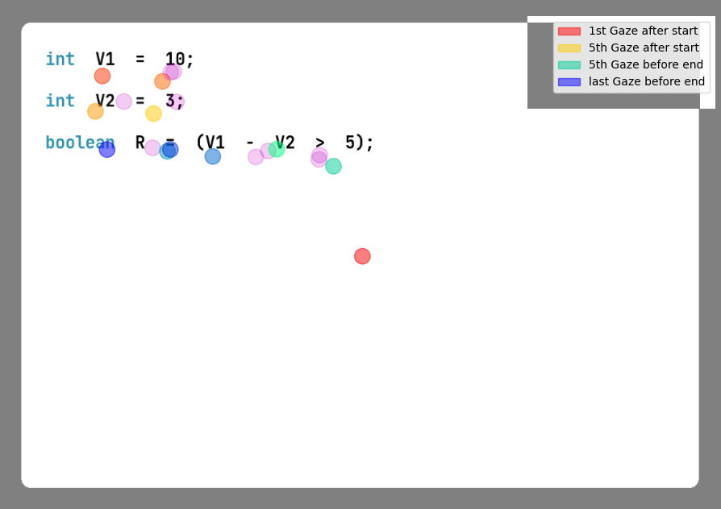
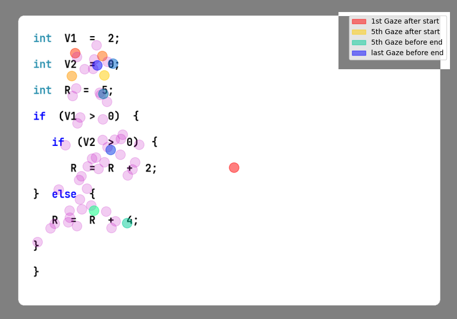
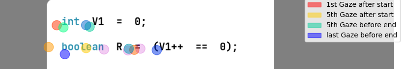
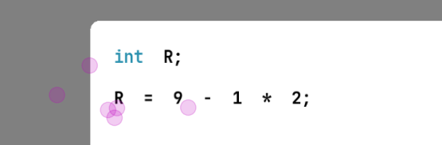
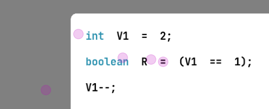
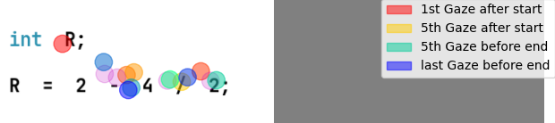
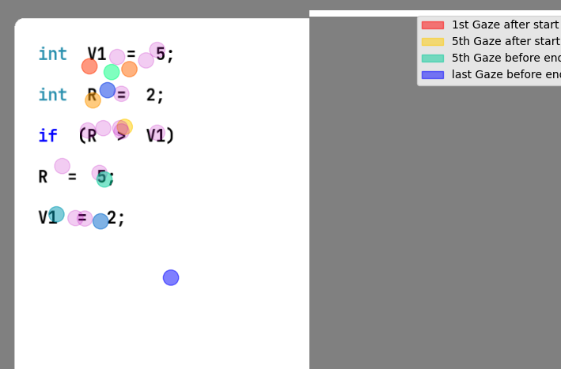
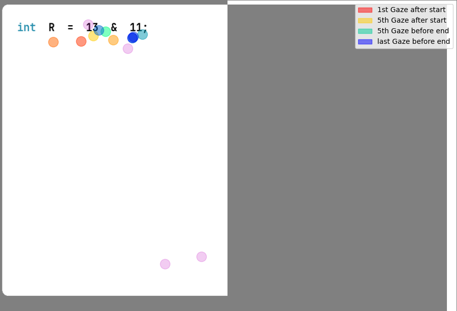

# Accuracy inspection

Status: performed -- manual

MANUAL INSPECTION OF ACCURACY IMAGES!!!
images found in: 
"{Trial_Recordings}\processed\{Participant}\Visual\DataAccuracy\DataAccuracy\DataAccuracy_Fixations_{snippet}.png"

mark results in manual evaluation files: 
"{Trial_Recordings}\processed\{Participant}\Visual\DataAccuracy_manual_evaluation.csv"

when finished, rename the manual evaluation file to "DataAccuracy_manual_evaluation_performed.csv"

For each viable snippet, there are up to multiple images portraying the fixation data accuracy:
* one subplot for the snippet view without corrected data (original)
* one or multiple subplots for the snippet view with corrected data from different algorithms (starting with "cluster_" or "stretch_")

Process:
1. Take a look at the original image and decide
   1. whether there are some first fixations still visible that have their origin in the participant looking at the fixation cross beforehand. If so, set the value in the according column "First Fixation for Fixation Cross (original)" to "True".

   1. whether there is a clear, distinctive offset in x-direction of all fixations in the snippet (fixations for a line start in "grey" border to the left, whether the fixations start only in the middle of a line without any reason). If so, set the value in the according column "Offset on x-axis visible (original)" to "True".

   Hint: Often, participants overlook signal words such as types and start only with the variable name. That is not a significant offset. In fact, if participants often seem to look at a type directly, it might be the indication for an offset.
   Also keep in mind that an offset is usually about consistent for a participant within a version (v0, v1, v2). If unsure, please also check other images of this participant.

   1. whether there are some fixations that are clearly outliers (very much outside the code snippet scope, not belonging to a code line).  If so, count them and state the number in the according column "Clear Outliers visible (original)".

   *If either 1.1, 1.2 or 1.3 takes hold, mark accordingly in the line and continue with the next snippet.*

1. Take a look at the images and decide whether and which data is suitable for further analysis.
   1. Check whether the original fixations lie directly on the code lines (no offset in y-axis). If so, they are suitable.
   1. Check for each algorithm whether the corrected fixations were assigned to the correct line.
   Hint: It is possible that a participant "overlooks" one or multiple lines, or that they return to lines they have already seen. Is this replicated from the original fixations in the corrected data? If so, they are suitable.
   1. If there is a high ambiguity based on the original fixations in whether a fixation belongs to a certain line or the next, mark "None" in the "Choice" column.
   1. If based on above both the original and a corrected version are acceptable, decide for the corrected data and mark its algorithm in the "Choice" column.
   1. If the original fixations are suitable but no correction, mark "original" in the "Choice" column.
   1. If one correction is suitable, mark its algorithm in the "Choice" column. 
   1. Enter the reasoning into the "Reason" column. 
   Reason criteria:
      - If Accepted: Describe what was acceptable about the dataset you have chosen.
      - Describe what was not acceptable about the dataset(s) not accepted.
      E.g., offset in y-axis for original data, misassignment of fixation for corrected data, ambiguity in line assignment for a fixation, ...

when finished, rename the manual evaluation file to "DataAccuracy_manual_evaluation_performed.csv"
