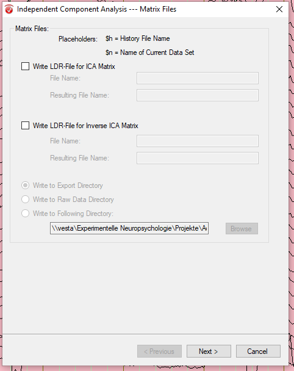
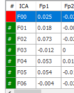

# EEG data preparation with BVA

Status: Performed -- semiautomatic with BVA Program

Location restrictions: to perform on computers in Psychopy Hiwi pool

Tool: Brain Vision Analyzer  (BVA)

## Tasks per Participant

The goal is to create a pipeline that performs the first processing steps for the eeg preparation pipeline. The pipeline in the left panel should look like this per eeg file from a participant:

A manual for BVA pipelines can be found under: `\vesta\Experimentelle Neuropsychologie\Software Knowledge Base\Software Knowledge Base\BrainVision Analyzer\BVA_Training_Regine\BVA_Quick_start.docx`

### 0. File Import

Save all EEG files (`.vhdr`, `.vmrk`,`.eeg`) of the participants to analyze in this folder:`\\vesta\Experimentelle Neuropsychologie\Projekte\AoC\EEG\analysis\raw`

### 0. Open BVA

Open BVA and import the workspace from the following server link:`\vesta\Experimentelle Neuropsychologie\Projekte\\AoC\EEG\analysis\AoC.wksp2`

All files are then shown in the data folder, as well as previously performed pipeline steps.

### 0. Copy Pipeline Elements

Per Drag and Drop, it is possible to copy elements of one pipeline to another file's pipeline. This can only be done for steps that need no manual input except for the initial configuration. This process copies the whole appended pipeline, not just the single step. However, the steps 1 (Raw DataInspection) and 4 (Inverse ICA) must be performed manually within the pipeline.

### 1. Raw Data

Double-click at Raw Data to open the data panel.
Go to the *Transformations* tab at the top of BVA and in the *Artifact Rejection/Reduction* area, select *Raw Data Inspection*.

In the pop-up, select *Manual Inspection* and confirm.

Now use the zooming feature below the tab and the navigation bar below the left panel to slide through the eeg data presented in the main screen.

During this presentation, mark (by clicking, dragging and letting go) any of the channels as bad artifacts for the given time period. Those will be ignored for ICA - very important!!!

Mark areas without trials as bad artifacts:

* the time before the start of the trials (empty of stimuli)
* breaks in-between trials due to

  - intended breaks in the experiment setup (empty of stimuli)
  - calibration failures (perhaps `S   1` or `S   3`, but no `S  11` or `S  12` present)
* the time after the end of the trials (empty of stimuli)

Mark detected artifacts, which are characterized as a high amount of voltage change in an isolated period of time. See image below where the red line marks an artifact (best seen at channels 5-9).

After you have looked through the whole file data, confirm the markers in the second to right panel.

Those markers will now show up as sections of *Bad Interval, Userdefined* in the exported marker file. It has no influence on the eeg data itself.

### 2. Filters

Go to the *Transformations* tab at the top of BVA and in the area of *Artifact Rejection/Reduction*, select *Data Filtering -> IIR Filters*.

In the popup, set the filter settings to:

* Low Cutoff: enabled, 0.05 Hz Order: 4 (slow frequencies are mostly ignored)
* High Cutoff: enabled, 30 Hz Order: 4 (high frequencies are mostly ignored --> order decides on the harshness of the cutoff)
* Notch Filter: enabled, 50 Hz (detects and removes frequencies based on power grid)

On the right side of the popup, you can see the frequencies that were cut off (white content of the plot).

Confirm the filter choices in the popup. This step modifies the eeg data.
MISSING IMAGES FILTER

### 3. ICA

Go to the *Transformations* tab at the top of BVA and in the area of *Frequency and Component Analysis*, select *ICA*.

In the popup, click through with the following settings:

Confirm the filter choices in the popup. This step trains the ICA on the filtered eeg data and applies it as well, and thus separates the data into 32 components. This step does not modify any data.

### 4. Inverse ICA

Go to the *Transformations* tab at the top of BVA and in the area of *Frequency and Component Analysis*, select *Inverse ICA*. In the popup, activate *Semiautomatic Mode*

You can see in the second to left panel the 32 components (F00-F31). They are per default activated, and can be deactivated with a double-click.

On the bottom of this panel set the view to subtracted, to show in the view panel the effect of each component on the data.

Now iterate over the components, activate each one by one, and look at the component's effects on the channels and the topography. For this, you can again slide and zoom through the data.

Decide against components that:

* relate to eye blinking (topography front red, back blue), peaks highly visible in EOG but also in other channels

* relate to eye movement (topography left red, right blue or vice versa), blocks highly visible in EOG but also in other channels
  
* relate to muscle artifacts (*topography centered around a single channel*, visible on just a single channel with only minimal influence on other channels)
  

If a component is unclear, ask somebody else or keep it included. Remove as little as possible as to not remove any required brain activity.

Mark those components as deactivated in the panel, and write this information down in an excel file with reasoning.

Then turn on the *corrected* view on the second to right panel to look at the resulting data. Look if there are any anomalies. Compare this view with the filtered view to see if there are artifacts missed or too many removed. This step modifies the eeg data.

### 5. Re-referencing

The data was collected with *AFz* as Ground and *A1* as Reference. As this reference setting is highly balanced to one side, we add another reference to the data, so that the average of both mastoids becomes the new reference. This is possible due to:

`for all channels a and electrodes A: a=A-Lm, thus we define the channel of the right mastoid r=Rm-Lm`

We now want the result:

`for all channels a' and electrodes A: a'=A-(Lm+Rm)/2=A-Lm/2-Rm/2=A-Lm-(Rm/2-Lm/2)=A-Lm-(Rm-Lm)/2=a-r/2 `

Go to the *Transformations* tab at the top of BVA and in the area *Dataset Preprocessing* select *New Reference*.

In the popup, select only A2 to add to as a reference and click on *Include Implicit Reference into Calculation of the New Reference*.

Apply new reference to all except *A2* and EOG channels. Set the name of the new Reference to `<empty>`.

Confirm this step in the popup. This step modifies the eeg data.

### 6. Export

After each pipeline step, it is possible to export the created data.

Go to the *Export* tab at the top of BVA and select *Generic Data*.

In the popup, activate header and marker file, and set the data file extension to *.eeg*.

Ste the data file format to binary with multiplexed data and line breaker in *UNIX* format.

For the binary data format, select 16 bit integer as the base data format

and export the data of all channels

Confirm the choices. Now the file is being created in the export folder `\\vesta\Experimentelle Neuropsychologie\Projekte\AoC\analysis\export`. 

Now, go to the export folder and copy the files as well as the excel sheet with the reasoning to the stick.
